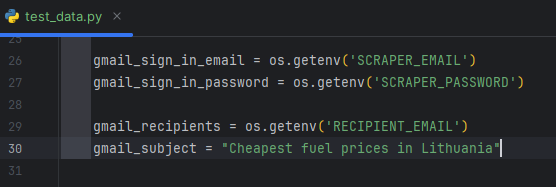
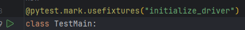

# Send cheapest gas station prices

This project allows you to scrape data from [Gas station prices] (https://gas.didnt.work/) insert data to excel file (different fuels inserted in different sheets), take the 5 cheapest prices convert to JSON and send email with information of the cheapest prices of the fuel. Email could be inserted via console  
```commandline
pytest tests.py --email=yourEmail@mail.com
```
or send to RECIPIENT_EMAIL from test_data email taken from .env file.

## Installation

*Follow these steps to clone repository:*

1. On GitHub.com, navigate to the main page of the repository.
2. Above the list of files, click <> Code
3. Copy the URL for the repository.
4. Open Git Bash.
5. Change the current working directory to the location where you want the cloned directory.
6. Type git clone, and then paste the URL you copied earlier. 
##

*Install to your local machine requirement.txt to get all libraries (python needs to be installed):*

1. Open terminal and navigate to the directory where you copied project
2. Type this command: 
```
pip install -r requirements.txt
```
##

*Create .env file in your main project directory and set email and password enviroments, they will be used in test_data.py file to foward emails and password via os.getenv()*


___


## How To Run Tests

In order to start test, go to GasPriceTest/tests/tests.py directory and run 
`
class TestMain:
`



## Feedback

If you have any feedback, please reach out.


